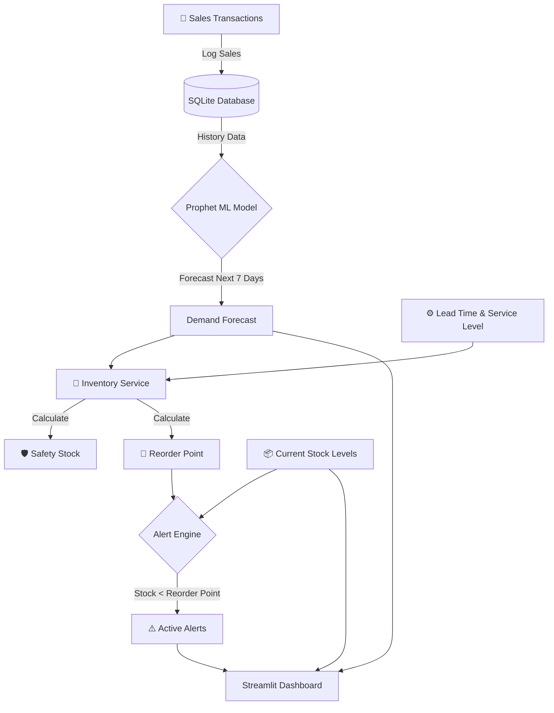

# 📦 Smart Inventory & Demand Forecasting System (fordemad)

[](https://fastapi.tiangolo.com/)
[](https://streamlit.io/)
[](https://facebook.github.io/prophet/)
[](https://github.com/astral-sh/uv)

A state-of-the-art, full-stack solution for modern supply chain management. This system leverages **Machine Learning (Facebook Prophet)** to predict customer demand, automates inventory calculations, and provides real-time proactive alerting.

---

##  Project Overview

Maintaining the perfect balance of stock is a critical challenge for businesses. Too much stock ties up capital; too little leads to missed sales. The **Smart Inventory System** solves this by:
- **Intelligent Forecasting**: Not just looking at past sales, but predicting future demand trends.
- **Automated Calculations**: Dynamic computation of Safety Stock and Reorder Points.
- **Proactive Alerts**: Notifying managers *before* a stockout occurs.
- **Actionable Insights**: Premium dashboard for data visualization and decision support.

---

##  System Work Flow

The following diagram illustrates the end-to-end data flow and logical processing within the system:



---

##  Technical Architecture

| Component | Technology | Role |
| :--- | :--- | :--- |
| **Backend** | **FastAPI** | High-performance asynchronous API for data management and orchestration. |
| **Frontend** | **Streamlit** | Multi-page interactive dashboard for inventory and forecast visualization. |
| **Machine Learning** | **Prophet** | Time-series forecasting model optimized for business seasonality. |
| **Database** | **SQLAlchemy + SQLite** | Robust ORM-based relational data storage. |
| **Environment** | **uv** | Blazing fast Python package management and runtime. |

---

##  Core Business Logic

The system automates complex supply chain mathematics to ensure high service levels:

###  Safety Stock
Buffer stock to protect against demand variability.
> **Formula:** $Safety\ Stock = Z \times \sigma_{demand} \times \sqrt{Lead\ Time}$
> *(Where Z = 1.65 for a 95% service level)*

###  Reorder Point (ROP)
The exact stock level that triggers a new purchase order.
> **Formula:** $ROP = (Average\ Daily\ Demand \times Lead\ Time) + Safety\ Stock$

---

## 📂 Project Structure

```text
project/
├── backend/            # FastAPI Application
│   ├── db/             # SQLAlchemy Models & Database Config
│   ├── routes/         # API Endpoints (Sales, Inventory, Alerts)
│   └── services/       # Business Logic & Reorder Orchestration
├── frontend/           # Streamlit UI
│   └── streamlit_app.py # Main Dashboard Interface
├── ml/                 # Machine Learning Module
│   └── prophet_model.py # Prophet Implementation & Validation
├── data/               # Source Data
│   └── sales_data.csv   # Historical sales dataset
└── pyproject.toml      # Dependency configurations
```

---

## 🚀 Getting Started

### 1. Prerequisites
- Python 3.10+
- [uv](https://github.com/astral-sh/uv) (Recommended) or `pip`

### 2. Installation
```bash
# Clone the repository
git clone https://github.com/Prahants/fordemad.git
cd fordemad

# Install dependencies
uv sync
```

### 3. Execution Workflow

#### Step A: Launch the Backend
```bash
uv run uvicorn backend.main:app --reload
```
*Docs available at http://localhost:8000/docs*

#### Step B: Initialize Data (Seeding)
```bash
curl -X POST http://localhost:8000/seed
```

#### Step C: Launch the Dashboard
```bash
uv run streamlit run frontend/streamlit_app.py
```

---

